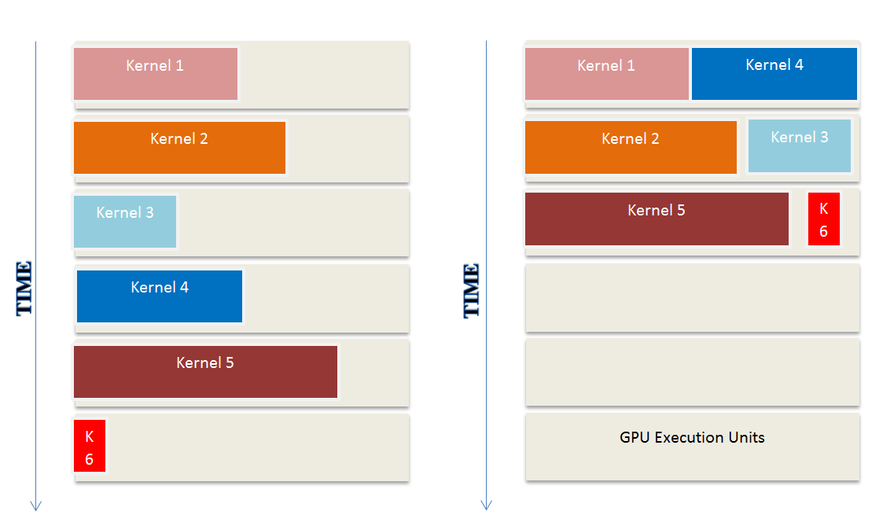
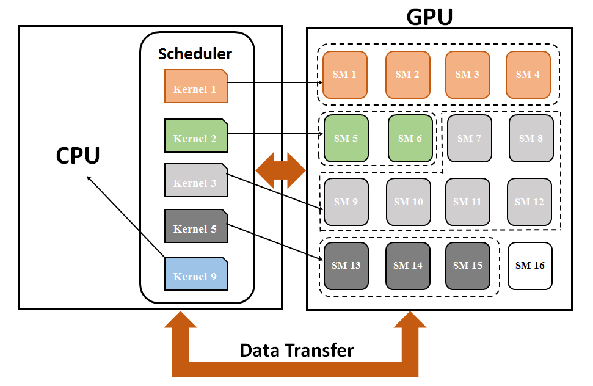

# Real Time Scheduler for Graphic Processing Units

## Dynamic schedule management framework for soft-real-time jobs on GPU based architectures

Graphics Processing Units (GPUs) are computational powerhouses that were originally designed for accelerating graphics applications. However, in recent years, there has been a tremendous increase in support for general purpose computing on GPUs (GPGPU). GPU based architectures provide unprecedented magnitudes of computation at a fraction of the power used by traditional CPU based architectures. As real-time systems integrate more and more functionality, GPU based architectures are very attractive for their deployment. 

However, in a real-time system, predictability and meeting temporal requirements are much more important than raw performance. While some realtime jobs may benefit from the performance that all cores of the GPU can provide, most jobs may require only a subset of cores in order to successfully meet their temporal requirements.  In this work, we implement concurrent scheduling of softreal-time jobs and a-periodic jobs on a GPU based platform, while optimizing the memory usage on the GPGPU.

Our ongoing work aims to develop a schedule management framework for soft-real-time jobs on GPU based architectures. Cores on a platform such as the NVIDIA Fermi architecture are organized into clusters, termed streaming multiprocessors (SMs). Cores within each SM share resources (register file, control units, L1 cache, etc.) and execute a common kernel. Our goal is to divide a real-time job into kernels and schedule kernels on the GPU, treating each SM as an indivisible unit. We propose to achieve this goal with minimal programmer involvement.

**The above image depicts our framework. As seen in the figure, our scheduling framework resides on a CPU core and dispatches kernels to the GPU.**

In general, a kernel consists of a set of thread blocks. When a kernel is dispatched to the GPU, a work distribution engine in the GPU schedules thread blocks on available SMs. The fundamental idea behind our technique is to divide a kernel into a set of controlled blocks of threads such that the number of threads per block is close to the total number of threads that a single SM can handle concurrently. For example, in the NVIDIA Fermi architecture, every SM is capable of supporting 1536 threads, among which 1024 threads can execute concurrently with minimal context switch costs. So, for this architecture, block sizes of 1024 threads are found to be a suitable choice. In this way, no more that one block may reside on a SM at a given time and hence, the number of blocks is a measure of the number of SMs that a kernel will occupy. We have conducted preliminary experimentation
on the NVIDIA Fermi platform to verify and evaluate the feasibility of this basic approach towards SM scheduling. Thus far, we have found the results to be encouraging.

We propose to exploit this basic idea to perform coarse-grained scheduling of jobs on SMs. Our work lays emphasis on minimal programmer involvement. To this end, we are developing a dynamic schedule management framework that is responsible for 1) keeping track of current and expected SM availability; 2) determining which kernel(s) to dispatch to the GPU at a given time; and 3) determining how many SMs to assign for a given kernel. These decisions will be made based on observed and predicted system state and on job characteristics (expected execution times, deadlines, etc.). 
